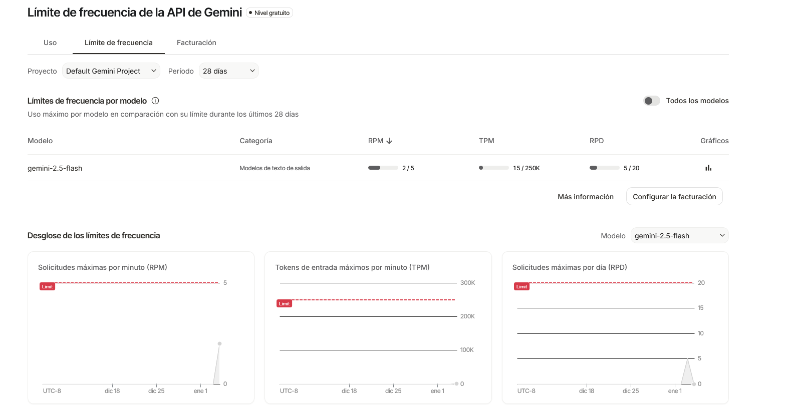

# LangChainAssistant

Small project to running a free version of a LangChain model and having our own chat agent

## Summary

- [Intro](#intro)
- [Project configuration](#project-configuration)

### Intro

### Project configuration

After creating the project directory, it is recommendable to working with a virtual environment. For simplicity, in this case I used *virtualenv*, but any other could be used instead.  
This time I pick Gemini as the agent provider, since it offers LLM free models to use.  
As usually, when using an external service, it is necessary to obtain the corresponding API key:  
  
  https://aistudio.google.com/app/api-keys
  
Once logged in with your Google user, and after accepting the licence Terms, we are capable to get the API key:

With that, we are in position to connect to the Google model trough LangChain.

### The LangChain model

But wait... What is LangChain??

Well, citing the short explanation in the [official website](https://docs.langchain.com/oss/python/langchain/overview): 

> "LangChain is an open source framework with a pre-built agent architecture and integrations for any model or tool — so you can build agents that adapt as fast as the ecosystem evolves"

In other words, it's a "tool" to building agents and applications that use LLM behind.

For getting the supported models:  

https://docs.langchain.com/oss/python/integrations/chat

In this parcitular case, it is going to be used *ChatGoogleGenerativeAI* (obviously pwered by Google...), beacuse it offers some free models, as I said previously.

#### Free models

In this page you can find more about the Gemini models:

https://ai.google.dev/gemini-api/docs/models?hl=es-419

From the list, those that could be used are (without paying...):

- gemini-3-flash
- gemini-2.5-flash
- gemini-2.5-flash-lite

But, altough they're free, the have their limitations. 

Rate limits are usually measured across three dimensions:

    Requests per minute (RPM)
    Tokens per minute (input) (TPM)
    Requests per day (RPD)

For more details, see the [rate-limits information](https://ai.google.dev/gemini-api/docs/rate-limits).  

Something interesting, is that you can check the [usage and billing of the model](https://aistudio.google.com/app/usage?timeRange=last-hour), since you have access to the *aistudio*, as you can see in the next image (sorry for language, is in spanish version...):  

### The code

The documentation related with this tool provided by Google can be found in [this link](https://docs.langchain.com/oss/python/integrations/chat/google_generative_ai).

